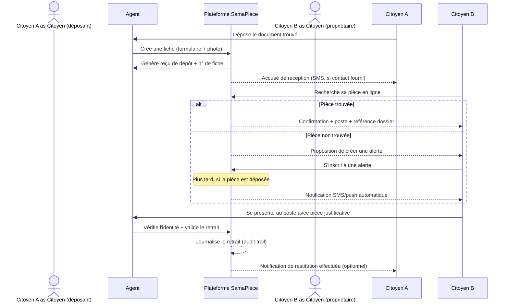
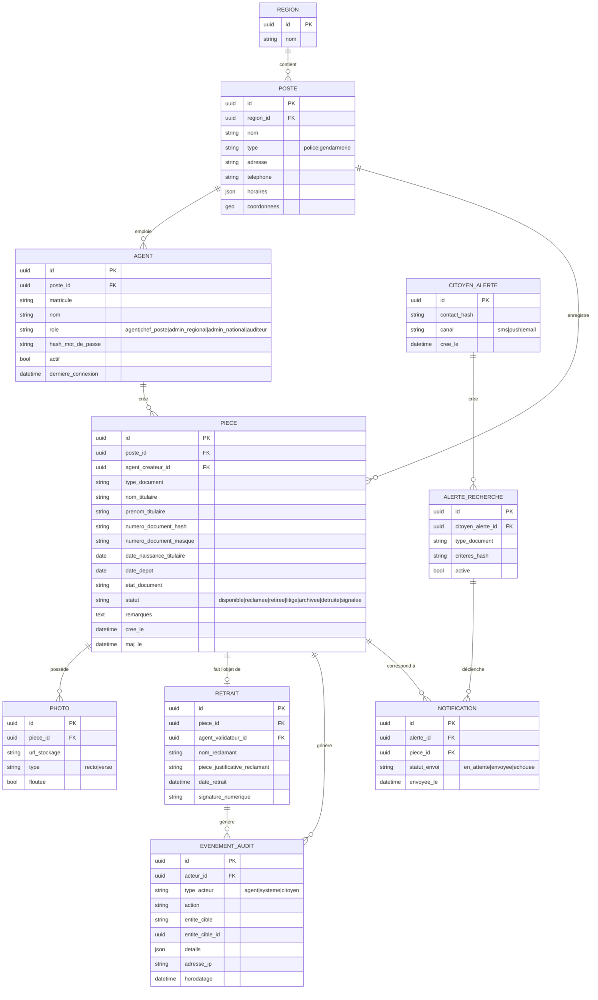
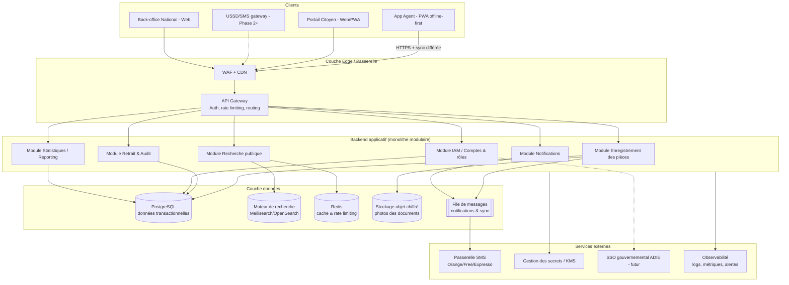

# SamaPièce — Plateforme numérique de signalement et de récupération des pièces d'identité perdues au Sénégal

> Document de contexte projet — version enrichie et détaillée.
> Base de départ : `note-de-projet-pieces-identite-perdues.docx`.
> Ce document sert de référence unique (source of truth) pour la suite du développement produit et technique. Il complète la note initiale en ajoutant les éléments manquants (acteurs, modèle de données, sécurité opérationnelle, architecture technique, API, plan de déploiement détaillé, risques, KPIs) et en approfondissant chaque section déjà présente.

**Statut** : Avant-projet / cadrage technique
**Dernière mise à jour** : 2026-09-12
**Périmètre géographique initial** : République du Sénégal (pilote Dakar, extension nationale ensuite)

---

## Sommaire

1. [Résumé exécutif](#1-résumé-exécutif)
2. [Contexte et problématique](#2-contexte-et-problématique)
3. [Objectifs du projet](#3-objectifs-du-projet)
4. [Périmètre du projet](#4-périmètre-du-projet)
5. [Parties prenantes](#5-parties-prenantes)
6. [Acteurs et personas](#6-acteurs-et-personas)
7. [Fonctionnalités détaillées](#7-fonctionnalités-détaillées)
8. [Fonctionnement du système (workflows détaillés)](#8-fonctionnement-du-système-workflows-détaillés)
9. [Modèle de données](#9-modèle-de-données)
10. [Protection des données et sécurité](#10-protection-des-données-et-sécurité)
11. [Architecture technique](#11-architecture-technique)
12. [API — aperçu des endpoints principaux](#12-api--aperçu-des-endpoints-principaux)
13. [Plan de déploiement](#13-plan-de-déploiement)
14. [Gestion des risques](#14-gestion-des-risques)
15. [Indicateurs de succès (KPIs)](#15-indicateurs-de-succès-kpis)
16. [Budget et ressources](#16-budget-et-ressources)
17. [Prochaines étapes](#17-prochaines-étapes)
18. [Annexes](#18-annexes)

---

## 1. Résumé exécutif

SamaPièce ("ma pièce" en wolof/français familier) est une plateforme numérique publique qui **centralise l'enregistrement des pièces d'identité retrouvées** par les citoyens et déposées dans les postes de police et brigades de gendarmerie du Sénégal, et qui **permet à toute personne ayant perdu un document de vérifier en ligne si celui-ci a été retrouvé**, sans avoir à se déplacer physiquement de poste en poste.

Le produit se compose de trois surfaces principales :

- **Application Agent** (usage interne, postes de police/gendarmerie) : enregistrement des pièces retrouvées, gestion des retraits, tableau de bord local.
- **Portail Citoyen** (public, web + mobile) : recherche sécurisée, alertes, suivi de statut.
- **Back-office national** (Ministère de l'Intérieur / ADIE) : supervision, statistiques, administration des postes et agents, audit.

Le projet est pensé pour un déploiement progressif (pilote → évaluation → national), avec une architecture résiliente aux contraintes locales (connectivité intermittente dans certaines zones, hétérogénéité des équipements) et conforme à la loi sénégalaise sur la protection des données personnelles (loi n°2008-12) sous supervision de la CDP.

---

## 2. Contexte et problématique

### 2.1 Constat

Au Sénégal, la perte de pièces d'identité (CNI, passeport, permis de conduire, carte d'électeur, extrait de naissance, carte grise, carte consulaire, etc.) est un phénomène courant. Lorsqu'un citoyen retrouve un document égaré par un tiers, le réflexe civique dominant est de le déposer au poste de police ou à la brigade de gendarmerie la plus proche, en attendant que le propriétaire vienne le réclamer.

### 2.2 Le problème central : absence de centralisation

Il n'existe aujourd'hui **aucun système d'information partagé** entre les postes de police/gendarmerie permettant de rapprocher automatiquement une pièce retrouvée de son propriétaire. Concrètement :

- Le rapprochement dépend du **hasard et du bouche-à-oreille**.
- Le citoyen qui a perdu un document doit **se déplacer physiquement, poste par poste**, sans aucune garantie de succès, ni méthode pour savoir où chercher en priorité (il ne sait pas dans quel poste sa pièce, si elle a été retrouvée, a été déposée).
- Les pièces non réclamées **s'accumulent dans des registres papier ou des tiroirs**, sans traçabilité centralisée, ni politique claire de conservation/destruction.
- Faute d'alternative, les citoyens engagent des **procédures de duplicata coûteuses et longues** (déplacement, frais de timbre, délais administratifs de plusieurs semaines), alors que leur document original existe déjà physiquement, quelque part.

### 2.3 Conséquences

| Impact | Détail |
|---|---|
| Coût citoyen | Frais de duplicata, transport, temps perdu, parfois besoin d'un intermédiaire ("démarcheur") |
| Coût administratif | Réémission de documents alors que l'original existe déjà ; charge de travail dupliquée pour l'état civil |
| Sécurité | Documents retrouvés non réclamés = risque de perte, de vol, de réutilisation frauduleuse (usurpation d'identité) faute de traçabilité |
| Confiance | Manque de visibilité du citoyen sur le devenir de ses démarches ; image d'un service public peu réactif |
| Encombrement | Accumulation physique de pièces dans des locaux exigus des postes, sans procédure de purge |

### 2.4 Pourquoi maintenant

- Le taux de pénétration du mobile et d'internet mobile au Sénégal permet d'envisager une recherche en ligne accessible au plus grand nombre (y compris via des interfaces légères adaptées aux connexions 3G/2G et aux téléphones d'entrée de gamme).
- L'ADIE dispose déjà d'infrastructures d'hébergement souverain et d'une expérience sur des plateformes publiques numériques sénégalaises, ce qui réduit le risque d'un projet greenfield isolé.
- La dynamique nationale de digitalisation des services publics (guichets uniques, e-services) crée un momentum institutionnel favorable à ce type d'initiative.

---

## 3. Objectifs du projet

### 3.1 Objectifs stratégiques

1. **Centraliser** l'enregistrement de toutes les pièces d'identité retrouvées et déposées dans les postes de police et gendarmeries du pays au sein d'un registre numérique unique.
2. **Permettre à tout citoyen** de vérifier en ligne, à tout moment, si sa pièce perdue a été retrouvée, sans se déplacer.
3. **Réduire les délais et les coûts** liés aux démarches de duplicata pour les citoyens et pour l'administration.
4. **Renforcer la confiance** entre citoyens et forces de l'ordre à travers un service public moderne, transparent et mesurable.
5. **Réduire la fraude et l'usurpation d'identité** liées à des documents perdus non tracés.

### 3.2 Objectifs opérationnels (SMART) — cibles indicatives à affiner avec le porteur institutionnel

| Objectif | Indicateur | Cible Phase 1 (pilote) | Cible Phase 3 (national, 18-24 mois) |
|---|---|---|---|
| Adoption agents | % de postes pilotes enregistrant systématiquement les pièces trouvées | ≥ 80% des postes pilotes | ≥ 60% des postes du pays |
| Taux de rapprochement | % de pièces enregistrées retrouvées par leur propriétaire sous 30 jours | ≥ 30% | ≥ 50% |
| Délai de restitution | Délai médian entre dépôt et retrait | ≤ 15 jours | ≤ 10 jours |
| Satisfaction citoyen | Score de satisfaction post-retrait (enquête in-app) | ≥ 4/5 | ≥ 4,3/5 |
| Disponibilité plateforme | Uptime du portail citoyen | ≥ 99% | ≥ 99,5% |
| Fraude | Nombre d'incidents de restitution frauduleuse détectés | 0 incident non détecté | 0 incident non détecté |

### 3.3 Non-objectifs (explicitement hors périmètre initial)

- Le projet **ne remplace pas** les procédures officielles de duplicata (CNI, passeport) : il **réduit le besoin** d'y recourir en facilitant la restitution de l'original.
- Le projet ne délivre **aucun document d'identité** et n'a **aucune autorité** sur l'état civil.
- Il ne s'agit pas d'un système de déclaration de perte à valeur légale (cette déclaration reste, si nécessaire, du ressort des procédures existantes de police).

---

## 4. Périmètre du projet

### 4.1 Dans le périmètre (In-scope)

- Enregistrement des pièces retrouvées par les agents des forces de l'ordre.
- Recherche publique sécurisée par le citoyen.
- Notifications automatiques (SMS / notification push / email).
- Gestion du cycle de vie d'une pièce : déposée → en attente → réclamée → retirée / non réclamée → archivée / détruite.
- Tableau de bord opérationnel par poste, région, et national.
- Journalisation et audit de toutes les actions sensibles.
- Back-office d'administration (gestion des postes, des comptes agents, des rôles).

### 4.2 Hors périmètre (Out-of-scope) — au moins pour la V1

- Déclaration de perte à valeur légale / dépôt de plainte en ligne.
- Émission ou réémission de documents d'identité.
- Interconnexion directe en temps réel avec les registres nationaux d'identité (ANEC, fichier électoral, etc.) — envisagée en Phase 4+ sous réserve d'accords institutionnels.
- Paiement en ligne (le service est gratuit pour le citoyen).
- Gestion des objets trouvés autres que les pièces d'identité (option d'extension future, ex. objets de valeur, plaques d'immatriculation).

---

## 5. Parties prenantes

| Partie prenante | Rôle | Niveau d'implication (RACI) |
|---|---|---|
| **Police nationale / Gendarmerie** | Utilisateurs principaux : enregistrement, gestion des retraits, exploitation du tableau de bord local | Responsible (R) / Accountable local |
| **Ministère de l'Intérieur** | Autorité de tutelle, portage institutionnel, arbitrages politiques et budgétaires | Accountable (A) global |
| **ADIE (Agence de l'Informatique de l'État)** | Partenaire technique : hébergement souverain, sécurité, éventuelle intégration SSO gouvernementale | Consulted / Support technique |
| **CDP (Commission de Protection des Données Personnelles)** | Autorité de contrôle : validation de la conformité du traitement de données personnelles, avis préalable/déclaration obligatoire | Consulted, avis obligatoire avant mise en production |
| **Citoyens** | Bénéficiaires finaux du service (recherche, notification, retrait) | Informed / utilisateurs finaux |
| **Collectivités locales / Mairies** *(partie prenante ajoutée)* | Relais de communication locale, points d'information possibles en zone rurale | Informed |
| **Opérateurs télécoms (Orange, Free/Tigo, Expresso)** *(partie prenante ajoutée)* | Fournisseurs de la passerelle SMS pour les notifications | Support technique |
| **Équipe projet / prestataire technique** *(partie prenante ajoutée)* | Conception, développement, exploitation (DevOps), support | Responsible (R) technique |
| **Société civile / associations de défense des droits numériques** *(partie prenante ajoutée)* | Vigilance sur la protection des données et l'usage éthique du système | Informed |

---

## 6. Acteurs et personas

*(Section ajoutée — absente de la note initiale, indispensable pour cadrer les user stories.)*

### 6.1 Agent de poste (« Agent »)

- **Profil** : policier ou gendarme affecté à l'accueil, niveau d'aisance numérique variable, souvent en sous-effectif, formation informatique limitée.
- **Besoin** : un formulaire d'enregistrement **rapide** (< 2 minutes), utilisable sur un ordinateur partagé ou une tablette, fonctionnant même avec une connexion instable.
- **Frustration actuelle** : registres papier, ressaisie manuelle, pas de visibilité sur ce qui a déjà été réclamé ailleurs.

### 6.2 Citoyen déposant

- **Profil** : toute personne ayant trouvé un document et souhaitant le rapporter.
- **Besoin** : pouvoir déposer facilement, recevoir une preuve de dépôt (reçu), ne pas être exposé à une charge administrative.

### 6.3 Citoyen chercheur (propriétaire du document perdu)

- **Profil** : grand public, tous âges, niveau d'équipement variable (smartphone bas de gamme, parfois simple accès SMS/USSD).
- **Besoin** : rechercher sa pièce avec un minimum d'informations, être notifié automatiquement si rien n'est trouvé au moment de la recherche, obtenir l'adresse et les horaires du poste concerné.

### 6.4 Chef de poste / Officier responsable

- **Profil** : supervise l'activité d'un poste, doit rendre compte à sa hiérarchie.
- **Besoin** : tableau de bord local (stock de pièces en attente, alertes sur pièces anciennes non réclamées), validation des retraits.

### 6.5 Administrateur régional / national (Ministère, ADIE)

- **Profil** : pilotage stratégique et opérationnel du dispositif à l'échelle régionale/nationale.
- **Besoin** : statistiques consolidées, gestion des comptes et des habilitations, audit, export de rapports.

### 6.6 Auditeur / CDP *(persona ajouté)*

- **Profil** : contrôle de conformité.
- **Besoin** : accès en lecture seule aux journaux d'audit, preuve de conformité (chiffrement, consentement, durée de conservation).

---

## 7. Fonctionnalités détaillées

*(La note initiale listait 5 fonctionnalités clés de façon sommaire. Cette section les reprend avec des critères d'acceptation et ajoute les modules manquants nécessaires à un système de production.)*

### 7.1 Module Agent — Enregistrement des pièces retrouvées

**Description** : formulaire simplifié permettant à un agent de créer une fiche pour chaque pièce retrouvée.

**Champs du formulaire** :
- Type de document (liste fermée : CNI, passeport, permis de conduire, carte d'électeur, extrait de naissance, carte grise, carte consulaire, autre)
- Nom et prénom(s) du titulaire (tels qu'affichés sur le document)
- Numéro du document (si lisible)
- Date de naissance du titulaire (si visible)
- Date et lieu (poste) de dépôt — pré-remplis automatiquement
- Identité du déposant (nom, contact — facultatif, pour traçabilité et éventuelle reconnaissance civique)
- Photo(s) du document (recto/verso), floutage automatique optionnel de la photo d'identité pour limiter l'exposition
- État du document (bon état, endommagé, illisible partiellement)
- Champ libre "remarques"

**Critères d'acceptation** :
- Le formulaire doit pouvoir être complété en moins de 2 minutes.
- La création de la fiche doit fonctionner **hors ligne** et se synchroniser dès le retour de la connexion (queue locale).
- Un **numéro de fiche unique** et un **reçu de dépôt imprimable/PDF** sont générés automatiquement.
- Détection de doublons : si une pièce avec un numéro de document identique existe déjà, alerte à l'agent avant création.

### 7.2 Module Citoyen — Recherche publique sécurisée

**Description** : interface publique (web + mobile) permettant de rechercher une pièce sans authentification forte, sans exposer les données d'autrui.

**Fonctionnement** :
- Recherche par combinaison d'informations : type de document + nom + (numéro de document si connu) + date de naissance (facultatif, réduit les faux positifs).
- Le résultat de recherche **ne révèle jamais l'intégralité des données** : il confirme uniquement qu'une pièce correspondant à des critères a été trouvée, indique le type de document, le poste de dépôt (nom, adresse, horaires), et une **référence de dossier** à présenter sur place.
- Aucune photo du document ni numéro complet n'est affiché publiquement (masquage partiel, ex. `1234******`).
- Limitation du nombre de tentatives (rate limiting) + CAPTCHA pour éviter le scraping / les attaques par force brute visant à retrouver les données d'un tiers.

**Critères d'acceptation** :
- Une recherche ne doit jamais permettre de reconstituer l'identité complète d'un tiers à partir de suppositions successives (protection contre l'énumération).
- Temps de réponse de la recherche < 2 secondes en conditions normales.
- Accessible en français et en wolof (a minima les libellés clés), interface simple compatible lecteurs d'écran.

### 7.3 Module Notifications

**Description** : alerte automatique lorsqu'une pièce correspondant à une recherche/alerte enregistrée précédemment est déposée.

**Fonctionnement** :
- Le citoyen peut, après une recherche infructueuse, **s'inscrire à une alerte** (numéro de téléphone + critères de recherche stockés de façon minimisée/hashée).
- Canal : SMS en priorité (fort taux de couverture, y compris téléphones basiques), complété par notification push si l'app mobile/PWA est installée, et email en option.
- Notification également envoyée au **citoyen déposant** (accusé de réception, et optionnellement lorsque la pièce est retirée — reconnaissance civique).

**Critères d'acceptation** :
- Délai d'envoi de la notification < 5 minutes après l'enregistrement d'une pièce correspondante.
- Mécanisme de retry avec files d'attente en cas d'échec de la passerelle SMS.
- Possibilité de se désinscrire (opt-out) à tout moment.

### 7.4 Module Tableau de bord (forces de l'ordre)

**Description** : suivi des pièces en stock, des retraits effectués, statistiques par poste et par région.

**Fonctionnalités** :
- Vue "stock courant" par poste (nombre de pièces en attente, ancienneté).
- Alertes sur pièces dépassant un seuil de conservation (ex. > 6 mois) pour déclenchement de la procédure d'archivage/destruction.
- Statistiques : taux de restitution, délai moyen, répartition par type de document, comparatif inter-postes/régions.
- Export de rapports (CSV/PDF) pour la hiérarchie.

### 7.5 Module Traçabilité et Audit

**Description** : historique des dépôts et des restitutions pour prévenir les fraudes.

**Fonctionnalités** :
- Journal d'audit immuable (qui a fait quoi, quand) pour toute action sensible : création de fiche, modification, consultation d'une fiche complète, retrait, suppression, export.
- Processus de retrait avec **double vérification** : présentation d'une pièce justificative alternative par le réclamant + validation par un second agent ou un superviseur pour les cas sensibles (ex. document de grande valeur, doute sur l'identité).
- Signature électronique simple (ou émargement numérique) du réclamant lors du retrait.

### 7.6 Modules complémentaires ajoutés (absents de la note initiale)

Ces modules sont nécessaires pour qu'un système de ce type soit réellement opérationnel, sûr et pérenne en production :

1. **Gestion des comptes et habilitations (IAM)**
   - Création/désactivation des comptes agents par un administrateur de poste ou régional.
   - Rôles : Agent, Chef de poste, Administrateur régional, Administrateur national, Auditeur (lecture seule).
   - Authentification forte pour les agents (mot de passe + OTP, ou intégration future avec un SSO gouvernemental de l'ADIE).
   - Rotation obligatoire des mots de passe, verrouillage après tentatives infructueuses.

2. **Gestion des doublons et fusion de fiches**
   - Détection automatique de doublons (même numéro de document, ou similarité nom + type + période).
   - Interface de fusion/rapprochement pour un superviseur.

3. **Gestion des litiges / réclamations contestées**
   - Cas où deux personnes revendiquent la même pièce, ou un doute sur l'authenticité du réclamant.
   - Workflow d'escalade vers le chef de poste, avec statut "en litige" bloquant temporairement le retrait.

4. **Cycle de vie / politique de conservation et destruction légale**
   - Statuts : `déposée` → `disponible` → `réclamée` → `retirée` | `non réclamée > seuil` → `archivée` → `détruite`.
   - Procédure d'archivage conforme à la réglementation sénégalaise sur les archives publiques avant toute destruction physique, avec traçabilité numérique de la décision.

5. **Mode dégradé / fonctionnement hors-ligne**
   - Application Agent conçue **offline-first** (Progressive Web App avec stockage local IndexedDB, synchronisation différée), essentielle pour les zones à connectivité intermittente.
   - File d'attente de synchronisation visible par l'agent (fiches "en attente d'envoi").

6. **Accessibilité et inclusion numérique**
   - Recherche également accessible via un canal **USSD ou SMS court code** pour les citoyens sans smartphone/internet — extension à évaluer en Phase 2/3.
   - Interface bilingue français/wolof, contraste et tailles de police adaptées, compatibilité lecteurs d'écran (WCAG 2.1 AA visé).

7. **Statistiques ouvertes / transparence (option)**
   - Publication d'indicateurs agrégés et anonymisés (nombre de pièces retrouvées par mois/région) sur un portail public de type "open data", sans aucune donnée personnelle, pour renforcer la confiance citoyenne.

8. **Support et assistance**
   - Centre d'aide / FAQ intégré, formulaire de contact, numéro vert pour les citoyens sans accès internet.
   - Canal de support dédié pour les agents (remontée d'incidents techniques).

9. **Gestion multi-organismes**
   - Le système doit accueillir à terme aussi bien des postes de **Police nationale** que des brigades de **Gendarmerie**, avec une hiérarchie organisationnelle distincte mais un référentiel de postes unique.

10. **Programme de formation et conduite du changement**
    - Modules de formation courte pour les agents (vidéo, guide PDF, session présentielle lors du déploiement pilote).

---

## 8. Fonctionnement du système (workflows détaillés)

### 8.1 Scénario nominal (aperçu enrichi)



### 8.2 Scénarios alternatifs et cas limites *(ajoutés — absents de la note initiale)*

| Cas | Traitement |
|---|---|
| Le réclamant ne peut pas prouver son identité de façon certaine | Statut "en attente de vérification complémentaire", escalade au chef de poste |
| Deux personnes réclament la même pièce | Statut "en litige", blocage du retrait, investigation manuelle |
| Document trouvé endommagé/illisible | Enregistrement quand même possible avec mention "partiellement illisible", champs optionnels |
| Pièce non réclamée après le délai réglementaire | Passage automatique en statut "archivage", notification finale, puis procédure légale de destruction |
| Agent quitte le poste avant de finaliser une fiche en mode hors-ligne | Fiche conservée en brouillon local, visible par tout agent du même poste à la reconnexion |
| Recherche citoyenne avec des critères trop vagues | Le système ne retourne aucun résultat individuel tant qu'un nombre minimal de critères discriminants n'est pas fourni (protection anti-énumération) |
| Fraude suspectée (ex. numéro de document falsifié) | Fiche marquée "signalée", transmise à un superviseur, exclue de la recherche publique en attendant investigation |

---

## 9. Modèle de données

*(Section entièrement ajoutée — nécessaire pour tout travail d'implémentation.)*

### 9.1 Entités principales



### 9.2 Principes de conception du modèle

- **Le numéro de document n'est jamais stocké en clair** : seul un **hash** (avec sel) est conservé pour permettre la recherche exacte, accompagné d'une version **masquée** (ex. `12●●●●89`) pour affichage aux agents habilités.
- Les **contacts des citoyens** (pour les alertes) sont également hashés/chiffrés ; ils ne sont déchiffrables que par le processus de notification, jamais consultables directement par un agent.
- Toute table métier sensible (`PIECE`, `RETRAIT`, `AGENT`) possède des colonnes d'audit (`cree_le`, `maj_le`, `cree_par`) et est répliquée dans `EVENEMENT_AUDIT` pour les actions de lecture/écriture sensibles.
- Séparation logique entre **données opérationnelles** (utilisées par l'app agent/citoyen) et **données d'audit/statistiques** (utilisées en lecture seule par le back-office national), pour limiter le risque d'accès croisé non nécessaire.

---

## 10. Protection des données et sécurité

*(La note initiale mentionnait la conformité de façon générale. Cette section la détaille en exigences concrètes.)*

### 10.1 Cadre légal et réglementaire

- **Loi n°2008-12 du 25 janvier 2008** relative à la protection des données à caractère personnel (Sénégal), et ses textes d'application.
- Encadrement par la **CDP (Commission de Protection des Données Personnelles)** : déclaration ou demande d'autorisation préalable du traitement, étant donné la nature sensible des données (données d'identité).
- Étude d'impact sur la protection des données (EIPD / PIA) à réaliser avant la mise en production, vu le volume et la sensibilité des données traitées.

### 10.2 Principes de minimisation

- La recherche publique ne restitue **jamais** de données personnelles complètes : uniquement une confirmation de correspondance + informations de localisation du poste.
- Aucune donnée biométrique n'est collectée. Seules les données déjà visibles sur le document physique sont enregistrées.
- Les photos de documents sont stockées de façon chiffrée et accessibles uniquement aux agents du poste concerné et aux rôles d'administration habilités — jamais exposées publiquement.
- Durée de conservation limitée et documentée (voir cycle de vie section 7.6.4), avec purge/anonymisation automatique après la période légale.

### 10.3 Contrôle d'accès

- **RBAC (Role-Based Access Control)** strict : un agent ne voit que les pièces de son poste ; un administrateur régional voit les statistiques agrégées de sa région (pas nécessairement le détail nominatif) ; seul un rôle habilité explicitement peut consulter une fiche complète.
- Principe du moindre privilège et séparation des tâches pour les opérations sensibles (ex. validation d'un retrait à forte valeur = double validation).
- Authentification forte des agents (MFA/OTP), sessions à expiration courte, verrouillage de compte après tentatives infructueuses.

### 10.4 Sécurité technique

- **Chiffrement en transit** : TLS 1.2+ obligatoire sur tous les flux (portail public, app agent, API, webhooks SMS).
- **Chiffrement au repos** : base de données et stockage objet des photos chiffrés (AES-256), gestion des clés via un service de gestion de secrets (Vault / KMS) séparé de l'application.
- **Hashing** des identifiants sensibles (numéro de document, contact citoyen) avec algorithme adapté et sel unique par enregistrement.
- **Journalisation immuable** (append-only) des accès aux fiches complètes et des exports de données.
- **Protection applicative** : validation stricte des entrées, protection CSRF/XSS/injection, limitation de débit (rate limiting) et CAPTCHA sur la recherche publique, pare-feu applicatif (WAF).
- **Tests de sécurité** réguliers : revue de code sécurité, tests d'intrusion (pentest) avant chaque mise en production majeure, scan de dépendances (SCA).

### 10.5 Gouvernance des données

- Registre des traitements tenu à jour (finalité, base légale, durées de conservation, destinataires).
- Procédure de gestion des demandes d'exercice de droits (accès, rectification) par les citoyens concernant leurs propres données.
- Procédure de notification de violation de données (breach notification) vers la CDP conformément aux délais légaux.
- Convention de responsabilité conjointe entre le Ministère de l'Intérieur (responsable de traitement) et l'ADIE ou le prestataire technique (sous-traitant), formalisée contractuellement.

---

## 11. Architecture technique

*(Section entièrement nouvelle — c'est le cœur de la demande : proposer un plan architectural technique solide.)*

### 11.1 Principes directeurs de l'architecture

1. **Souveraineté et hébergement local** : hébergement prioritaire sur une infrastructure souveraine (datacenter ADIE / cloud national), pour des raisons légales et de confiance institutionnelle.
2. **Offline-first pour les agents** : la connectivité dans certains postes (zones rurales) ne peut pas être garantie en continu ; l'application agent doit rester utilisable en mode dégradé.
3. **Simplicité avant scalabilité prématurée** : un **monolithe modulaire** bien architecturé est préférable à des microservices dès le départ, compte tenu de la taille d'équipe probable et du volume de données (dizaines de milliers de fiches/an, pas des millions de transactions/seconde). Migration vers des services séparés seulement si un module (ex. notifications) devient un goulot d'étranglement démontré.
4. **Sécurité par conception (security by design)** et **minimisation des données** à chaque couche.
5. **Architecture évolutive par paliers**, alignée sur les 3 phases de déploiement (pilote → évaluation → national) : le système doit supporter une montée en charge progressive sans refonte complète.
6. **Auditabilité de bout en bout** : toute action sensible doit être traçable a posteriori.

### 11.2 Vue d'ensemble de l'architecture



### 11.3 Choix d'architecture applicative

**Approche retenue : monolithe modulaire ("modular monolith") en couches, avec séparation stricte des modules métier par domaine (bounded contexts).**

Justification :
- Équipe de développement probablement réduite au démarrage (2 à 5 développeurs) → un monolithe modulaire réduit la complexité opérationnelle (un seul déploiement, une seule base de code à faire évoluer) tout en gardant une séparation claire des responsabilités internes.
- Le volume de données attendu (milliers à dizaines de milliers de fiches par an à l'échelle nationale) ne justifie pas la complexité opérationnelle de microservices distribués dès la V1.
- Les modules sont conçus avec des **interfaces internes claires** (ports/adapters), ce qui permettra d'extraire un module en service indépendant plus tard (ex. le module Notifications, s'il doit gérer un volume important d'envois SMS) sans réécriture complète.

**Modules internes** :
- `enregistrement` : cycle de vie de création/mise à jour des fiches pièces.
- `recherche` : indexation et requêtes de recherche publique (avec anonymisation des résultats).
- `notifications` : gestion des alertes, files d'attente, intégration passerelle SMS/push/email.
- `retrait_audit` : validation des retraits, journal d'audit immuable.
- `iam` : gestion des comptes, rôles, authentification, habilitations.
- `reporting` : agrégations statistiques, exports, tableaux de bord.

### 11.4 Stack technique recommandée

| Couche | Choix recommandé | Justification |
|---|---|---|
| Frontend Portail Citoyen | **PWA** (React ou Vue) + rendu côté serveur (Next.js/Nuxt) pour SEO/perf sur connexions lentes | Fonctionne sur mobile bas de gamme, installable, cache pour réseau instable |
| Frontend App Agent | **PWA offline-first** (React + service worker + IndexedDB, ex. via Dexie.js) | Nécessité impérative de fonctionnement hors-ligne en poste |
| Backend API | **Java 21 + Spring Boot 3 (Spring Web, Spring Security, Spring Data JPA)** | Écosystème mature et éprouvé pour les systèmes d'information publics/critiques, typage fort, forte communauté d'intégrateurs au Sénégal ; découpage en packages par domaine (`enregistrement`, `recherche`, `notifications`, `retrait_audit`, `iam`, `reporting`) aligné avec l'architecture modulaire de la §11.3 (Spring Modulith en option pour faire respecter les frontières entre modules) |
| Base de données | **PostgreSQL** | Fiabilité, support JSON natif, extensions géospatiales (PostGIS) pour localiser les postes, forte communauté |
| Migrations de schéma | **Flyway** (intégré nativement à Spring Boot) | Versionnement des migrations SQL en base, rejouable à chaque environnement |
| Recherche | **Meilisearch** (léger, auto-hébergeable) ou OpenSearch si besoin plus avancé | Recherche tolérante aux fautes de frappe sur les noms, faible empreinte d'exploitation |
| Cache & rate limiting | **Redis** (via Spring Data Redis / Bucket4j pour le rate limiting) | Standard, supporte aussi les files d'attente légères |
| File de messages | **Spring AMQP + RabbitMQ** (ou file Redis simple en V1 pilote) | RabbitMQ = intégration Spring native, fiable pour les files de notifications, migration possible vers Kafka si le volume l'exige |
| Stockage objet (photos) | **MinIO** (S3-compatible, auto-hébergeable chez ADIE) ou service cloud souverain équivalent, via le SDK AWS S3 côté Spring Boot | Compatible S3, chiffrement natif, hébergeable localement |
| Passerelle SMS | Intégration API **Orange SMS API / Free / Expresso** (à confirmer selon accords) | Couverture maximale des citoyens sénégalais |
| Authentification | **Spring Security + OAuth2/OIDC (Spring Authorization Server ou Keycloak)** pour les agents, préparation à une fédération avec un futur SSO ADIE | Standard, interopérable, JWT signés pour les échanges API |
| Secrets/KMS | **HashiCorp Vault** ou équivalent | Séparation stricte du stockage des secrets/clés de chiffrement |
| Conteneurisation | **Docker** + orchestration **Docker Compose** (V1/pilote) puis **Kubernetes** (national) si nécessaire | Portabilité, montée en charge progressive sans sur-ingénierie initiale |
| CI/CD | **GitLab CI** ou **GitHub Actions** | Automatisation tests, build, déploiement |
| Observabilité | **Grafana + Prometheus** (métriques), **Loki** ou **ELK** (logs), **Sentry** (erreurs applicatives) | Stack open-source auto-hébergeable, cohérent avec la contrainte de souveraineté |

### 11.5 Infrastructure et hébergement

- **Hébergement principal** : datacenter ADIE ou cloud souverain sénégalais, en environnements isolés **dev / staging / production**.
- **Plan de sauvegarde (backup)** : sauvegardes chiffrées quotidiennes de la base de données et du stockage objet, tests de restauration trimestriels.
- **Plan de reprise d'activité (PRA/DRP)** : réplication vers un second site (ou au minimum sauvegardes hors-site), RTO cible ≤ 4h, RPO cible ≤ 1h pour la Phase national.
- **Haute disponibilité progressive** : instance unique pour le pilote (Phase 1), réplication base de données (primaire/secondaire) et load-balancing applicatif dès la Phase 3 (national).
- **Réseau** : accès agent via VPN ou réseau gouvernemental sécurisé si disponible, sinon accès HTTPS public avec authentification forte et restriction par device/certificat pour les comptes agents.

### 11.6 Scalabilité et performance

- Phase 1 (pilote, quelques postes à Dakar) : charge estimée faible (< 1000 fiches/mois), une seule instance applicative suffit.
- Phase 3 (national, ~1000+ postes) : anticiper plusieurs dizaines de milliers de fiches/mois, pics de recherche publique lors de campagnes de sensibilisation. Prévoir :
  - Mise en cache agressive des recherches publiques les plus fréquentes.
  - Index de recherche dédié et scalable horizontalement.
  - Autoscaling des instances API derrière le load balancer.
  - Séparation des charges lecture/écriture (réplicas PostgreSQL en lecture pour le reporting).

### 11.7 Accessibilité, connectivité et résilience terrain

- Compression et redimensionnement automatique des photos côté client avant envoi (réduction de la consommation data).
- Mode texte allégé pour le portail citoyen sur connexion lente (détection de bande passante, dégradation gracieuse des images).
- File de synchronisation visible et robuste côté app agent (retry automatique, résolution de conflits simple par horodatage + revue manuelle en cas de doublon détecté).
- Étude d'un canal **USSD** pour la recherche basique (ex. `#XXX#`) en Phase 2/3 pour couvrir les citoyens sans smartphone.

### 11.8 Observabilité et exploitation

- Tableaux de bord techniques : disponibilité, latence API, taux d'erreur, longueur des files de notification.
- Alerting automatique (ex. échec répété de la passerelle SMS, saturation du stockage objet, pic d'erreurs 5xx).
- Journal d'audit fonctionnel (section 10.4) distinct des logs techniques d'exploitation.

### 11.9 CI/CD et environnements

- Trois environnements : `dev` (intégration continue), `staging` (recette fonctionnelle avec les forces de l'ordre pilotes), `production`.
- Pipeline backend : `mvn verify` (tests unitaires JUnit 5 + tests d'intégration Testcontainers/PostgreSQL) → analyse de dépendances (OWASP Dependency-Check) → build image Docker (Spring Boot layered jar) → déploiement staging → validation manuelle → déploiement production. Pipeline frontend : lint/build/tests en parallèle.
- Feature flags pour activer progressivement de nouveaux modules (ex. USSD, statistiques ouvertes) sans big-bang release.

---

## 12. API — aperçu des endpoints principaux

*(Aperçu indicatif, à formaliser en spécification OpenAPI lors du cadrage technique détaillé.)*

```
POST   /api/v1/pieces                       Créer une fiche pièce (agent authentifié)
GET    /api/v1/pieces/{id}                  Consulter une fiche complète (agent habilité)
PATCH  /api/v1/pieces/{id}                  Mettre à jour une fiche
POST   /api/v1/pieces/{id}/photos           Téléverser une photo de document

POST   /api/v1/recherche-publique           Recherche citoyenne (anonyme, rate-limited)
POST   /api/v1/alertes                      Créer une alerte de recherche (citoyen)
DELETE /api/v1/alertes/{id}                 Se désinscrire d'une alerte

POST   /api/v1/pieces/{id}/retrait          Enregistrer un retrait (agent + validation)
POST   /api/v1/pieces/{id}/signaler         Signaler une fraude/anomalie sur une fiche

GET    /api/v1/postes                       Liste des postes (public, pour affichage carte)
GET    /api/v1/statistiques/poste/{id}      Statistiques d'un poste (agent/admin)
GET    /api/v1/statistiques/nationales      Statistiques agrégées (admin national)

POST   /api/v1/auth/login                   Authentification agent (+ MFA)
POST   /api/v1/auth/refresh                 Rafraîchissement de session

GET    /api/v1/audit/evenements             Consultation des journaux d'audit (auditeur/admin)
```

Toutes les routes non publiques exigent un jeton **OAuth2/JWT** avec vérification de rôle (RBAC) côté API Gateway et côté module métier (défense en profondeur).

---

## 13. Plan de déploiement

*(Reprend et détaille les 3 phases de la note initiale avec des jalons techniques concrets.)*

### Phase 1 — Pilote (durée indicative : 3 à 4 mois)

**Objectif** : valider le concept sur un périmètre restreint (quelques postes de police à Dakar).

Jalons techniques :
- Cadrage détaillé, validation juridique préalable avec la CDP.
- Développement du MVP : module Enregistrement, module Recherche publique, module Notifications (SMS uniquement), IAM basique.
- Hébergement sur environnement staging/production restreint.
- Formation des agents des postes pilotes.
- Recette fonctionnelle avec utilisateurs réels.

Critères de sortie de phase : ≥ 80% des postes pilotes enregistrent effectivement les pièces trouvées ; taux de rapprochement mesurable ; aucun incident de sécurité/fuite de données.

### Phase 2 — Évaluation (durée indicative : 2 à 3 mois)

**Objectif** : mesurer l'adoption, ajuster techniquement et opérationnellement avec les agents de terrain.

Jalons techniques :
- Collecte de retours utilisateurs (agents et citoyens), ajustements UX.
- Renforcement de la résilience offline (si problèmes de synchronisation constatés).
- Ajout du tableau de bord de reporting avancé et des modules complémentaires jugés prioritaires (ex. gestion des litiges, doublons).
- Audit de sécurité externe (pentest) avant extension.

Critères de sortie de phase : plan de remédiation des problèmes identifiés exécuté ; validation formelle du Ministère de l'Intérieur pour l'extension.

### Phase 3 — Extension nationale (durée indicative : 12 à 18 mois, par vagues régionales)

**Objectif** : généralisation progressive à l'ensemble des postes de police et gendarmeries, avec formation des agents.

Jalons techniques :
- Passage à une architecture haute disponibilité (réplication, autoscaling — voir §11.6).
- Déploiement par vagues régionales successives (plutôt qu'un big-bang national), avec accompagnement au changement à chaque vague.
- Mise en place du support utilisateur à grande échelle (centre d'assistance, hotline).
- Étude et éventuel lancement du canal USSD/SMS court code pour l'inclusion numérique.
- Explorations d'intégrations institutionnelles futures (statistiques ouvertes, interconnexions avec d'autres registres, sous réserve d'accords).

### Phase 4 — Pérennisation et évolutions (au-delà, optionnelle) *(ajoutée)*

- Extension possible à d'autres objets trouvés (plaques d'immatriculation, objets de valeur).
- Étude d'interconnexion sécurisée avec les registres nationaux d'identité pour automatiser certains rapprochements (sous conditions légales strictes).
- Programme d'amélioration continue basé sur les KPIs (section 15).

---

## 14. Gestion des risques

*(Section ajoutée.)*

| Risque | Catégorie | Probabilité | Impact | Mitigation |
|---|---|---|---|---|
| Refus/lenteur d'autorisation de la CDP | Légal | Moyenne | Élevé | Engager le dialogue avec la CDP dès le cadrage, réaliser l'EIPD en amont |
| Faible adoption par les agents (résistance au changement, charge de travail perçue) | Adoption | Moyenne | Élevé | Formulaire ultra-simplifié, formation, implication des chefs de poste dès le pilote |
| Connectivité insuffisante dans certains postes | Technique | Élevée | Moyen | Architecture offline-first, synchronisation différée |
| Fraude / restitution frauduleuse d'une pièce | Sécurité | Faible | Élevé | Double vérification, journal d'audit, formation anti-fraude |
| Fuite de données personnelles | Sécurité | Faible | Très élevé | Chiffrement, minimisation, tests d'intrusion réguliers, gestion stricte des accès |
| Dépendance à un opérateur SMS unique | Technique | Moyenne | Moyen | Intégration multi-opérateurs avec bascule automatique |
| Sous-financement du passage à l'échelle nationale | Financier/Organisationnel | Moyenne | Élevé | Déploiement par vagues (phase 3), démonstration de valeur mesurable dès le pilote |
| Doublons/erreurs de saisie dégradant la qualité des données | Qualité des données | Élevée | Moyen | Détection de doublons automatique, validation à la saisie |

---

## 15. Indicateurs de succès (KPIs)

*(Complète et structure les indicateurs esquissés en section 3.2 et dans "Impact attendu" de la note initiale.)*

**Indicateurs d'usage**
- Nombre de pièces enregistrées par mois / par poste / par région.
- Nombre de recherches publiques effectuées.
- Taux de conversion recherche → alerte créée.

**Indicateurs d'efficacité**
- Taux de rapprochement (pièces restituées / pièces enregistrées).
- Délai médian entre dépôt et retrait.
- Taux de pièces non réclamées après le délai légal (à minimiser).

**Indicateurs de qualité de service**
- Disponibilité (uptime) du portail citoyen et de l'app agent.
- Délai de notification après dépôt correspondant.
- Score de satisfaction citoyen post-retrait.

**Indicateurs de sécurité/conformité**
- Nombre d'incidents de sécurité détectés / résolus.
- Délai de traitement des demandes d'exercice de droits (RGPD-like).
- Résultat des audits de sécurité périodiques (0 vulnérabilité critique ouverte).

**Indicateurs d'impact institutionnel**
- Nombre de demandes de duplicata évitées (estimation par enquête déclarative).
- Couverture nationale (% de postes actifs sur la plateforme).

---

## 16. Budget et ressources

*(Section ajoutée — estimation indicative à affiner avec le porteur institutionnel et un chiffrage détaillé.)*

### 16.1 Équipe type pour la Phase 1 (pilote)

- 1 Product Owner / chef de projet fonctionnel
- 2-3 développeurs full-stack
- 1 ingénieur DevOps/sécurité (temps partiel)
- 1 designer UX/UI (temps partiel)
- 1 référent juridique/conformité (temps partiel, coordination CDP)
- 1 chargé de formation/conduite du changement (à partir de la phase pilote terrain)

### 16.2 Postes de coûts à anticiper

- Développement (Phases 1-2).
- Hébergement souverain (ADIE ou équivalent) — coût récurrent.
- Passerelle SMS — coût variable à l'usage (par SMS envoyé), potentiellement significatif à l'échelle nationale.
- Audit de sécurité externe (pentest) — récurrent, au moins annuel.
- Formation et déploiement terrain (Phase 3) — coût logistique important lors de l'extension nationale (déplacements, supports pédagogiques).
- Maintenance et support (post-lancement, budget continu).

*(Un chiffrage détaillé nécessite un cadrage budgétaire avec le Ministère de l'Intérieur/ADIE — non disponible dans la note initiale.)*

---

## 17. Prochaines étapes

*(Reprend les 3 étapes de la note initiale et les précise/complète.)*

1. **Identifier un poste de police pilote et un interlocuteur** au sein des forces de l'ordre (Police nationale et/ou Gendarmerie), avec engagement formel de participation au pilote.
2. **Formaliser un dossier technique détaillé** : architecture (base : ce document), budget chiffré, calendrier détaillé, et **dossier de conformité CDP** (EIPD, registre des traitements).
3. **Solliciter un rendez-vous avec le Ministère de l'Intérieur et/ou l'ADIE** pour présenter le projet et sécuriser le portage institutionnel et l'hébergement souverain.
4. *(ajouté)* **Réaliser un prototype cliquable (Figma) ou un MVP technique minimal** pour valider l'ergonomie du formulaire agent et de la recherche citoyenne avant développement complet.
5. *(ajouté)* **Engager un premier contact avec un opérateur télécom** (Orange/Free/Expresso) pour évaluer les conditions d'intégration de la passerelle SMS.
6. *(ajouté)* **Constituer l'équipe projet** (cf. §16.1) et lancer le développement du MVP de la Phase 1.

---

## 18. Annexes

### 18.1 Glossaire

- **CDP** : Commission de Protection des Données Personnelles (Sénégal).
- **ADIE** : Agence de l'Informatique de l'État (Sénégal).
- **RBAC** : Role-Based Access Control, contrôle d'accès basé sur les rôles.
- **PWA** : Progressive Web App, application web installable fonctionnant hors-ligne.
- **EIPD/PIA** : Étude d'Impact sur la Protection des Données / Privacy Impact Assessment.
- **RTO/RPO** : Recovery Time Objective / Recovery Point Objective (indicateurs de reprise d'activité).

### 18.2 Document source

Ce document enrichit et remplace, comme référence de travail, la note initiale `note-de-projet-pieces-identite-perdues.docx` (conservée dans le dossier du projet à titre d'archive historique).

### 18.3 Historique des versions

| Version | Date | Changement |
|---|---|---|
| 0.1 | — | Note de projet initiale (.docx) |
| 1.0 | 2026-09-12 | Réécriture complète : ajout des acteurs/personas, modèle de données, sécurité détaillée, architecture technique complète, API, risques, KPIs, budget |
| 1.1 | 2026-09-12 | Backend recentré sur **Java 21 + Spring Boot 3** (Spring Security, Spring Data JPA, Flyway, RabbitMQ) en remplacement de l'option Node.js/Python |
